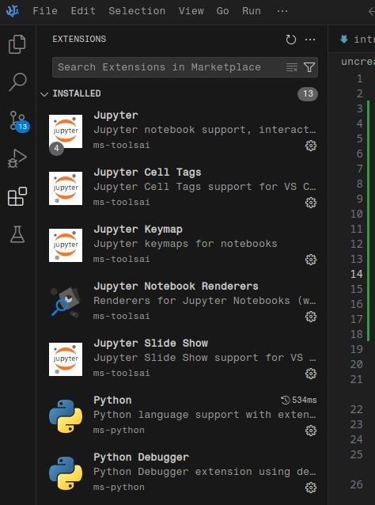
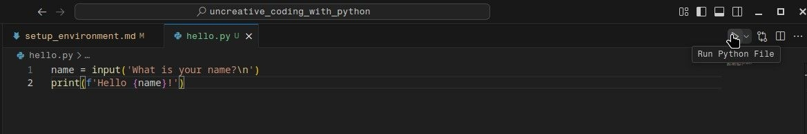

# Setup environment

## Code Editor 

We'll work with VSCode / VSCodium:

[VSCode](https://code.visualstudio.com/) — VSCode developed by Microsoft

[VSCodium](https://vscodium.com/) — VSCode without tracking and telemetry

### Extensions

After installation, go to the `Extensions`-tab and install the following extensions:

- Python 
- Jupyter 



## Virtual environment

It is recommended to create a virtual environment for your project/ setup. All the libraries and dependencies installed for this project are isolated and won't conflict other libraries and their dependencies. The easiest way to create a virtual environment is **conda**.

[Anaconda or Miniconda?](https://docs.conda.io/projects/conda/en/latest/user-guide/install/download.html#anaconda-or-miniconda) 

The main difference is that Anaconda has a GUI to manage/ start environments. In addition more libraries are installed than with miniconda. **Miniconda is controlled through the CLI, which is faster and lighter. It's also enough when working from within VSCode.**

### Miniconda

[Download](https://www.anaconda.com/docs/getting-started/miniconda/install) Miniconda for your OS and execute the installer. (The easiest way is the [CLI Installation](https://www.anaconda.com/docs/getting-started/miniconda/install#quickstart-install-instructions).)

Open the Terminal inside VSCode: `View` -> `Terminal` and type the following commands, line by line, execute each one of them with pressing `Enter`.

``` shell
# check if conda is installed
conda --version
```

#### Create a new environment

Change the name `<my_environment>` in the code below to a name of your choice. (It's common that variable values inside code snippets are enclosed by `<` and `>`, like below. If so, replace the name *inclusive* `< >` with a name of your choice.) This is the name of your environment and you have to type it when you start it later on, so make sure it's not too long and easy to remember.

``` shell
# create a new environment with Python version 3.12
conda create -n <my_environment> python=3.12 -y
# for example: 
# conda create -n uncreativepython python=3.12 -y
```

You can see all environments created by you with the following command:

```shell
# list available environments
conda env list
```

Next we can activate our newly created environment. (Of course you have to insert your environments name in the place of `<my_environment>`.)

```shell
# activate your environment
conda activate <my_environment>
```

### Install external packages with pip

We can use Python's package installer **pip** to install external libraries like [fpdf2](https://pypi.org/project/fpdf2/).

```shell
# important: activate your environment first
conda activate <my_environment>

# install the library fpdf2 with pip
pip install fpdf2
```

### Deactivate conda

When we've finished our work, we can deactivate the environment with:

```shell
# deactivate environment
conda deactivate
```

### Remove an environment

```shell
conda remove -n <my environment> --all
```

## Python

[Python](https://www.python.org/) is an easy to write general purpose programming language, meaning it can be used for a variety of different applications.

### Scripting language

Python is a [scripting language](https://www.wikiwand.com/en/Scripting_language). Code written in Python is interpreted on the fly, instead of compiled into a piece of software beforehand.
Python can be used to write stand-alone software, but (as other scripting languages) it can also be used to extend the functionality of existing software.

For example Python scripts can extend 

- Blender
- Grasshopper
- GIMP
- FontForge
- Glyphs

## Terminal 

As a scripting language Python can be used inside the console/terminal (Command Line Interface) of your OS in an **interactive** mode: type a line of code, press Enter and it's interpreted.

```
~$ python                                                                                  
>>> name = input('What is your name?\n')
What is your name?                                                                      
AI Lab                                   
>>> print(f'Hello {name}')
Hello AI Lab                                                                            
>>>   
```

(The `$` is an indicator for code that's written in the CLI. If you see `>>>` before Python code, this means that it's written in an interactive session.)

Code is nothing else then plain text. Let's save it as a file.

`hello.py`
```python
name = input('What is your name?\n')
print(f'Hello {name}!')
```

We can execute an openend file inside VSCode with the `Play`-Button.



We'll see the results inside the Terminal below.

## Appendix

### Terminal emulators 

Here are some terminal emulators (beyond the default one of your OS):

**Cross Platform**

[Alacritty](https://alacritty.org/)

[Kitty](https://sw.kovidgoyal.net/kitty/)

[Tabby](https://tabby.sh/) 

**Linux**

[Terminator](https://gnome-terminator.org/)

[Konsole](https://konsole.kde.org/)

**Mac**

[iTerm2](https://iterm2.com/)
